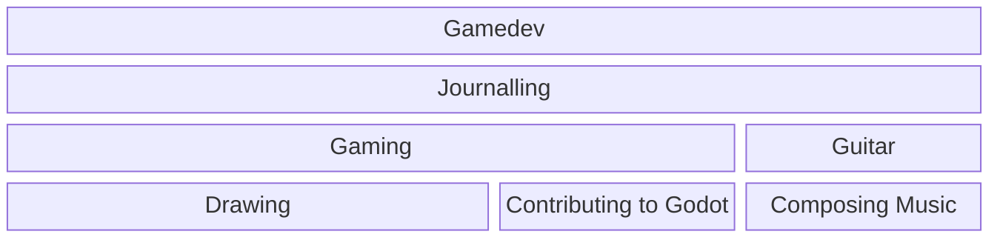

# Hi, I'm WinnerWind.
 No, I am not an anime girl. 

I'm just a regular 16 year old, armed with a internet connection, and a computer.
## About me
- 🫥 Pronouns: he/him, but I don't get offended easily.
- 🎂 Birthday: 16th February!
- 🍄 Fun Fact: This is the first time I've put my birthday on the internet.

## Things I do
 Yes, there were so many I had to write a block diagram for it 

## Contact
- Email : [elbowsparse@gmail.com](mailto:elbowsparse@gmail.com?subject=Hello!&body=Hey%20there!%0A)
- Discord : `winnerwind`
- More on [my website](https://winnerwind.github.io/contact)
- I actually have another website, https://winnerwind.in

<!--
**WinnerWind/WinnerWind** is a ✨ _special_ ✨ repository because its `README.md` (this file) appears on your GitHub profile.

Here are some ideas to get you started:

- 🔭 I’m currently working on ...
- 🌱 I’m currently learning ...
- 👯 I’m looking to collaborate on ...
- 🤔 I’m looking for help with ...
- 💬 Ask me about ...
- 📫 How to reach me: ...
- 😄 Pronouns: ...
- ⚡ Fun fact: ...
-->
